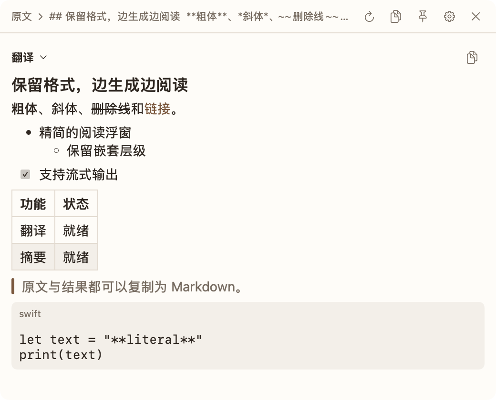

<div align="center">
  
  <h1>Digger</h1>
  <p><strong>Words, made clear.</strong></p>
  <p>A native macOS assistant for translating, summarizing and exploring selected text.</p>
</div>

Select text in another app and press **⌘E**. Digger runs enabled prompts in parallel and displays the answers in a floating window.



## A native workspace

The interface is built with **SwiftUI + AppKit**, with warm paper surfaces, brown accents, and automatic light/dark appearance. See the [redesign decision and validation notes](docs/native-redesign.md).

The app icon uses a cream serif `d` on a walnut brown tile. Run `swift scripts/app-icon.swift` to regenerate its PNG and all macOS icon sizes.

- **Works where you read** — reads selections through macOS Accessibility; browser HTML is converted locally to Markdown to retain lists and links. Temporary clipboard copies restore the previous clipboard.
- **Your prompts, in parallel** — translation starts enabled and summary disabled; enable, disable, add, edit or remove custom actions and edit a shared system prompt.
- **Bring your model** — configure an OpenAI-compatible endpoint, API key, model and reasoning effort; test the connection from Settings.
- **Stable streaming** — answers arrive in a scrollable window that stays in place. Resize, drag or pin it as needed.
- **Readable results** — streaming Markdown with nested lists, tables, headings, quotes, links, selectable text and literal code blocks.
- **Control the work** — stop a generation, retain partial answers, or retry while bypassing the cache. Closing the window cancels active work.
- **Copy what you need** — source, individual results or all results; `⌘⇧C` copies results, `⌘⌥C` includes the source.
- **Local cache** — configurable capacity and expiration, stored on this Mac.
- **Mac essentials** — menu bar access, a configurable global shortcut, launch at login, permission guidance, English, 简体中文 and 日本語.

Force Touch is no longer used. No trackpad configuration is required.

## Get started

Requirements: macOS 13+, an OpenAI-compatible API, Accessibility permission, and a Swift 6.2+ toolchain for building.

```sh
git clone https://github.com/mrcroxx/digger.git
cd digger
swift run digger
```

1. Grant Digger Accessibility access in System Settings.
2. Open **Settings → API**, enter the endpoint, API key and model, then test the connection.
3. Select text in another app and press `⌘E`.

Existing API settings, prompts and cache are retained when upgrading. If a newly built app is not recognized by macOS Accessibility, grant access to the new build and reopen it. Stable signing avoids repeated identity changes.

## Settings

| Page | Controls |
| --- | --- |
| General | Language, streaming, launch at login |
| Popup | Typography preview, font size, background opacity, shortcut, window dimensions |
| Prompts | Shared system prompt, per-action enable switches and native multiline editors |
| API | Endpoint, key, model, reasoning effort and connection test |
| Cache | Capacity, expiration and cache directory |

Changes save automatically. Tooltips follow native macOS timing.

## Build and validate

```sh
swift build
swift test
/usr/bin/python3 scripts/test-transport.py
CREATE_DMG=0 ./scripts/build-app.sh
```

The app is written to `dist/Digger.app`. For a debuggable app bundle, use `BUILD_CONFIGURATION=debug CREATE_DMG=0 ./scripts/build-app.sh`. Quit the running app before replacing `/Applications/Digger.app` with the new bundle. Run `./scripts/build-app.sh` without `CREATE_DMG=0` to also create a DMG. Signing/notarization options are documented in the build script.

The transport test starts a temporary loopback-only API with fixture text and a fake key. It validates streaming, cache, errors, request payloads and cancellation without contacting a provider.

GitHub Actions runs on pull requests and pushes to `main`: macOS 15 with Xcode 26.2 builds Debug, runs the local fixture tests, and packages and verifies a Release app. Each successful run uploads `Digger-macOS.zip` for seven days. The app is ad-hoc signed for local use, not notarized; CI needs no API key or signing certificate and does not generate a DMG.

Review the UI offline in a debug build:

```sh
swift run digger --preview
swift run digger --preview --settings
swift run digger --preview --welcome --dark
```

If a shortcut does not open the popup, stop Digger with `Ctrl+C` and check the current registration from the same terminal:

```sh
swift run digger --diagnose
```

The menu bar also shows the configured shortcut and its status. `--preview` intentionally does not register a global shortcut.

## Data and permissions

Selected text and prompts are sent directly to the API endpoint you configure when you invoke Digger. API settings remain in local preferences. Responses may be cached in `~/Library/Caches/digger/translation-cache`. Digger does not log selected text or generated results.

Accessibility is used for reading the selection. The global shortcut is registered independently, so it can explain missing permissions. Digger does not require trackpad drivers or a browser runtime. Its Markdown renderer does not fetch remote images or execute HTML.

## Structure

```text
Sources/digger/
  App/            Bootstrap, menus and offline debug preview
  EventTap/       Global shortcut and outside-click observation
  Selection/      Accessibility extraction and cancellable prompt execution
  Translation/    OpenAI-compatible client and local cache
  Preferences/    Persisted settings and SwiftUI editor
  Welcome/        Permission guidance
  UI/             Design system, result state, Markdown and floating panel
Tests/            State, geometry, Markdown, endpoint and transport regression tests
scripts/          Local transport fixture, build and packaging
```

Older documents in `docs/` describe historical implementations; [native-redesign.md](docs/native-redesign.md) describes the current architecture.

## License

No license file is currently included in this repository.
