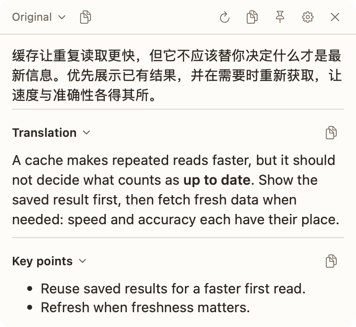
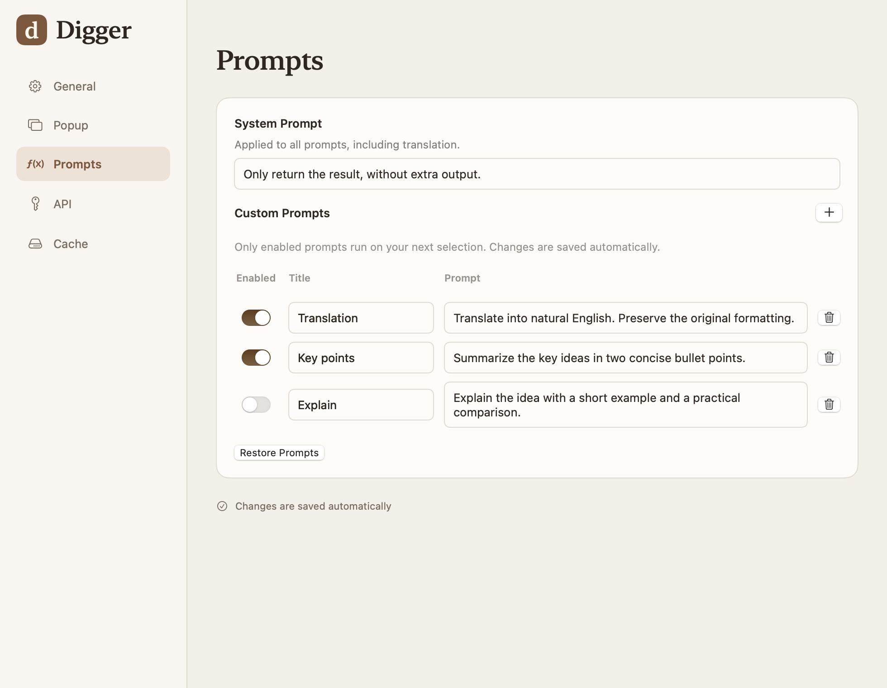
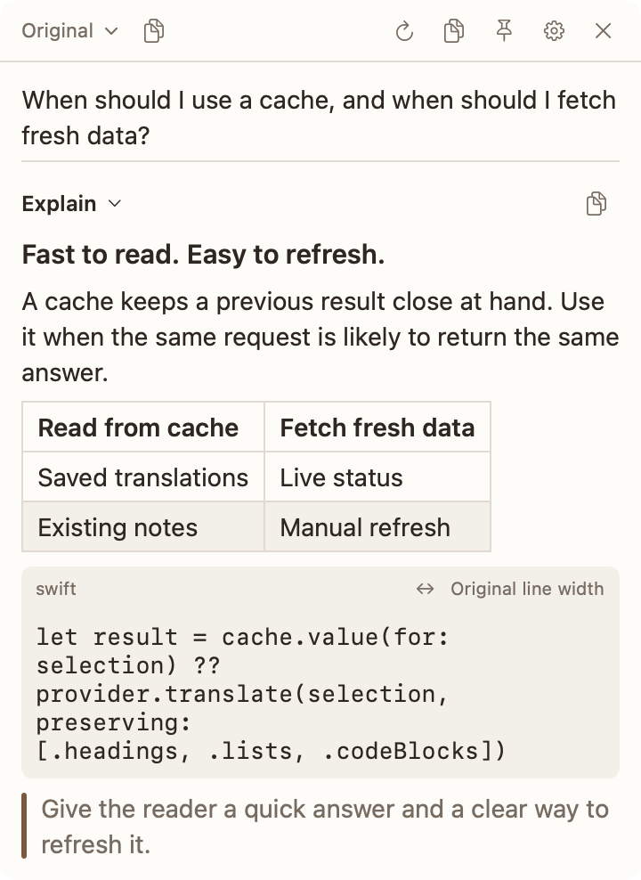
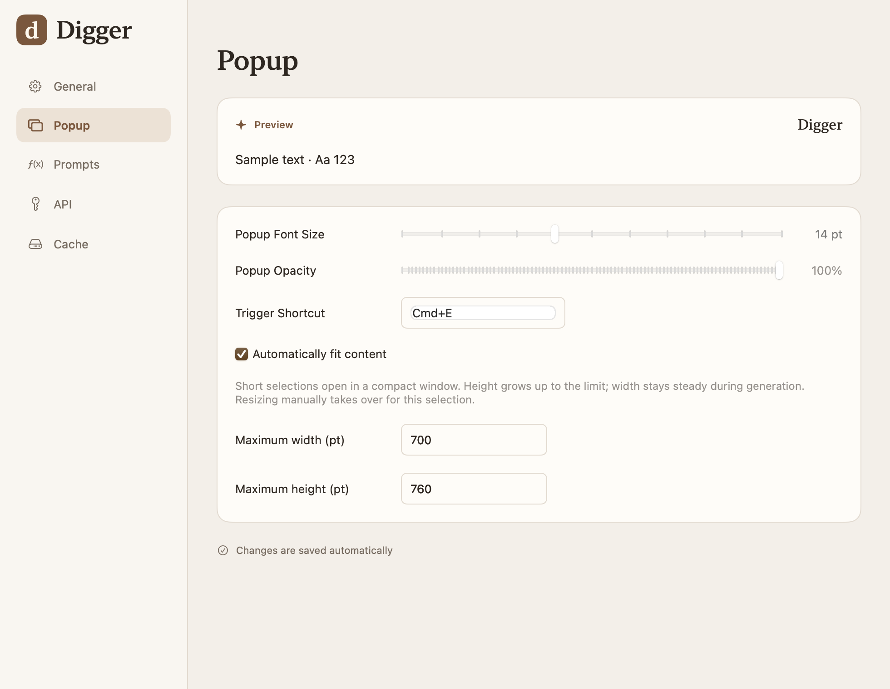
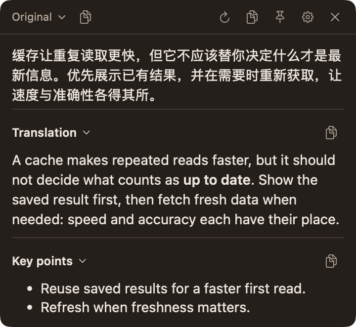
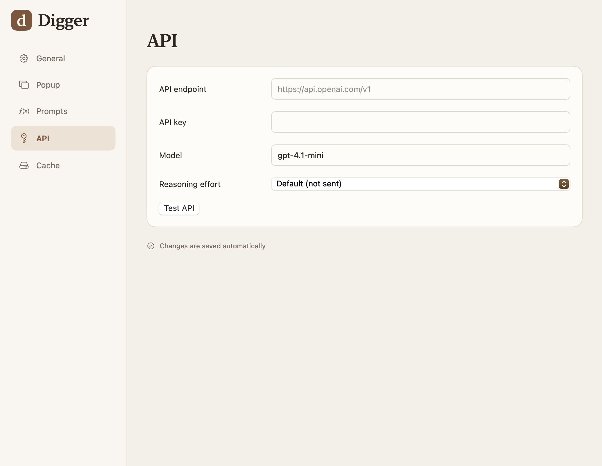

# Digger

**Words, made clear.**

A native macOS assistant for the text you're reading. Select a passage, press
**⌘E**, and get a translation, a summary, or an explanation in a floating
window. Keep reading while your answers arrive.

> 🌐 [简体中文](README.zh.md)
>
> [Features](#features) · [Get started](#get-started) · [Development](#development) · [Documentation](#documentation)



*Screenshots show the current native app in isolated preview mode with example
text and prompts. No real API credentials or provider responses are used.*

## Features

### One selection, more than one answer

Read a passage in your browser, a document, or another app that exposes text
selection to macOS. Press **⌘E** to bring the answers alongside your work.
Enabled prompts run in parallel, so a translation and a short summary can
arrive together.

Expand the original to compare it with the results, collapse a section to
make room, or pin the window while you read. Copy one answer, all answers,
or the answers together with the source.

### Make the prompts yours

Translate a paragraph. Pull out the key ideas. Explain an unfamiliar term.
Choose which actions run for each selection, and write the prompts that fit
your work in **Settings → Prompts**.

- **Run only what you need.** Enable or disable each action independently.
- **Set a shared style.** A system prompt applies across your actions.
- **Edit comfortably.** Open a prompt in the native multiline editor.

Translation is enabled by default; Summary is available to turn on. The
screenshots use a custom setup with Translation and Key points enabled.



### Read the answer, keep the structure

Answers render as Markdown, including headings, nested lists, quotes, links,
tables, and code. Browser selections can retain their HTML structure through
local Markdown conversion, keeping useful context with the text.

Code wraps to the window width by default; switch to **Original line width**
when spacing matters. Wide tables scroll horizontally. Text stays selectable,
and you can copy the underlying Markdown to your notes.



### A window that fits your reading

Short selections open compactly. As an answer streams in, the window grows
in height up to your chosen limit, then scrolls. Its reading width stays
steady during generation. Resize it yourself to take control for that selection,
or choose fixed dimensions in Settings.

Adjust the font size, opacity, and global shortcut. The SwiftUI and AppKit
interface follows your Mac's light or dark appearance, with English,
简体中文, and 日本語 interfaces.

<details>
<summary><strong>Appearance and dark mode</strong></summary>





</details>

### Your model, ready when you need it

Connect an **OpenAI-compatible API** with your own endpoint, key, and model.
Choose a reasoning effort supported by your provider, and test the connection
from Settings.

Completed results can be cached locally, with a capacity and expiration you
control. Retry to request a fresh answer without reusing the cache. Stop a
running generation and keep the partial text; closing the window cancels
active work.

<details>
<summary><strong>Provider settings</strong></summary>



The screenshot uses the public default endpoint and an empty key field.
Configure your own provider before using Digger.

</details>

## Get started

Requires **macOS 13 or later**, **Accessibility permission**, and an
**OpenAI-compatible API**. Digger runs as a native menu bar app.

### Install the macOS app

1. Open a successful main-branch run of [CI](https://github.com/mrcroxx/digger/actions/workflows/ci.yml?query=branch%3Amain).
2. Download **Digger-macOS**, extract it, and open the DMG. Check that the
   architecture in the filename matches your Mac.
3. Drag **Digger.app** into Applications and open it.
4. Grant **Accessibility** access when prompted, then configure your endpoint,
   API key, and model in **Settings → API**. Click **Test API**.
5. Select text in another app and press **⌘E**.

CI artifacts are retained for seven days and are ad-hoc signed, without Apple
notarization. If an artifact has expired or you need another architecture,
build locally using the commands below. See the [development guide](docs/development.md)
for signing and installation details.

### Keep it close

Open Settings from the menu bar, change the global shortcut to suit your
workflow, and enable launch at login if you want Digger ready after signing in.

| Shortcut | Action |
| --- | --- |
| **⌘E** | Run enabled prompts on selected text; configurable in Settings |
| **⌘⇧C** | Copy all results while the popup is active |
| **⌘⌥C** | Copy the original and all results while the popup is active |

### Your data and your provider

When you invoke Digger, selected text and prompts are sent directly to the
API endpoint you configure. Local caching does not make AI generation offline.
Settings, including the API key, are stored in macOS preferences on this Mac;
the key is currently stored in **UserDefaults**, not Keychain.

Responses may be cached in `~/Library/Caches/digger/translation-cache`.
Digger does not log selected text or generated results. Its Markdown renderer
does not fetch remote images or execute HTML. When selection capture needs a
temporary clipboard copy, Digger restores the previous clipboard contents.

## Development

Requires a **Swift 6.2+ toolchain** on macOS. From a checkout:

```bash
git clone https://github.com/mrcroxx/digger.git
cd digger
swift run digger
```

Build an installer:

```bash
DIGGER_MAC_UNSIGNED=1 ./scripts/package-desktop.sh
```

This runs the packaging checks and tests, then creates `dist/Digger.app`,
a DMG, and a ZIP for the build Mac's architecture. Packaging does not install
the app. Use a stable signing identity for a regular local installation;
see the [development guide](docs/development.md).

Explore the interface with offline example content, or regenerate the screenshots:

```bash
swift run digger --preview --showcase --english
python3 scripts/capture-readme.py
```

## Documentation

- [Development and packaging](docs/development.md) — builds, signing, validation, and shortcut troubleshooting.
- [Screenshot provenance](docs/images/README.md) — capture commands, sample content, and privacy.
- [Native interface](docs/native-redesign.md) — the design system and native app architecture.

Other session notes in `docs/` record historical implementations and may
describe behavior that has since changed.
