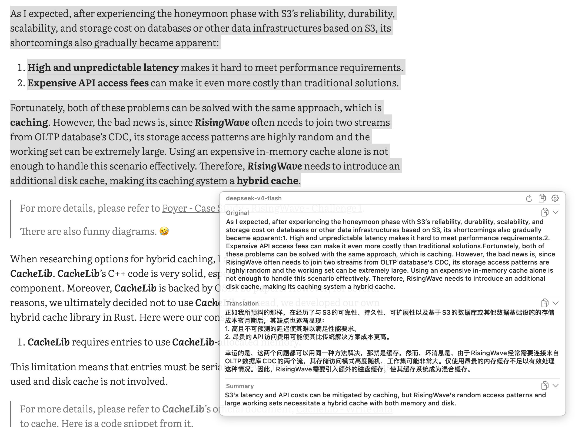
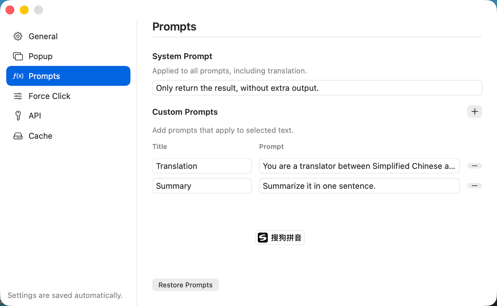
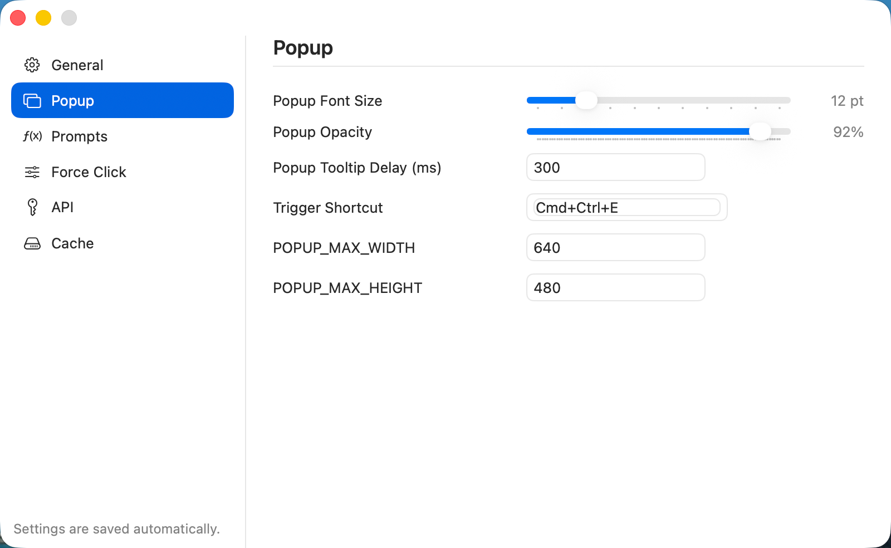
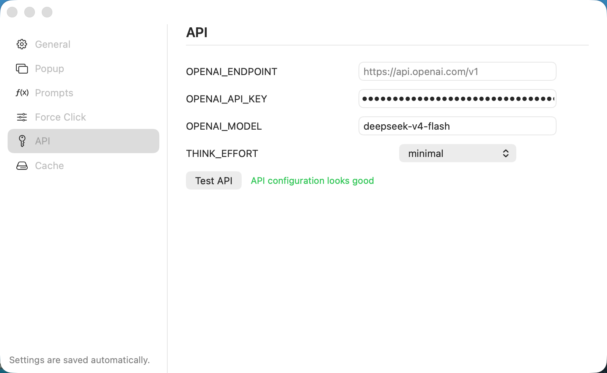

<div align="center">
  
  <h1>Digger</h1>
  <p><strong>Turn selected text into useful AI answers without leaving your current app.</strong></p>
  <p>A lightweight, customizable macOS menu bar assistant for translation, summarization, explanation, and more.</p>
</div>

## What is Digger?

Digger brings AI actions directly to the text you are reading. Select text in almost any macOS app, then force-click or press a configurable global shortcut. Digger reads the selection and opens a compact result window beside your cursor—no copying into a chat window and no context switching.

Each selection can run multiple prompts in parallel. The built-in Translation and Summary actions are only a starting point: add your own prompts for rewriting, proofreading, code explanation, terminology lookup, or any workflow supported by your model.

<p align="center">
  
</p>

## Highlights

- **Works where you read** — trigger Digger from selected text in browsers, editors, documents, and other macOS apps.
- **Force click or keyboard shortcut** — use trackpad pressure or a customizable global shortcut (default: `Command + E`).
- **Multiple results at once** — run every configured prompt concurrently and view the results in one popup.
- **Fully customizable prompts** — edit the shared system prompt and create as many task-specific actions as you need.
- **OpenAI-compatible APIs** — configure the endpoint, API key, model, and reasoning effort, including compatible third-party providers.
- **Fast feedback** — stream responses as they arrive, or use non-streaming mode when preferred.
- **Practical popup controls** — copy individual sections or the complete result, collapse sections, retry while bypassing the cache, open Preferences, select result text, and drag the popup anywhere.
- **Local disk cache** — reuse identical results to reduce latency and API cost, with configurable size and expiration.
- **Native macOS experience** — menu bar operation, launch at login, first-run permission guidance, and English, Simplified Chinese, and Japanese interfaces.

## How it works

1. Select a word, paragraph, or code snippet in the app you are using.
2. Force-click the selection or press the configured shortcut.
3. Digger sends the text to your configured API for each configured prompt.
4. Results appear together in a popup near the cursor, ready to read or copy.

For a single word, the built-in translation prompt produces a compact bilingual dictionary entry. Longer text is translated while preserving formatting, Markdown structure, placeholders, numbers, and proper nouns.

## Make it yours

Digger's behavior is configured from its menu bar Preferences. Changes are saved automatically.

### Build your own AI actions

The system prompt applies to every action. Custom prompts define what Digger should do with the selected text, and all configured actions run in parallel.

<p align="center">
  
</p>

### Tune the popup

Adjust the font size, opacity, tooltip delay, global shortcut, and maximum popup dimensions to fit your workflow.

<p align="center">
  
</p>

### Bring your own model

Point Digger at OpenAI or another OpenAI-compatible endpoint, choose a model and reasoning effort, then validate the configuration with **Test API**.

<p align="center">
  
</p>

## Getting started

### Requirements

- macOS 13 or later
- A Force Touch trackpad for the force-click trigger (the keyboard shortcut works without one)
- An API key for OpenAI or an OpenAI-compatible provider
- Accessibility permission for reading selected text and listening for the global shortcut
- Xcode 16+ or a Swift 6.2 toolchain when building from source

### Build and run from source

```bash
git clone https://github.com/mrcroxx/digger.git
cd digger
swift build
swift run digger
```

On first launch:

1. Grant Digger Accessibility access when prompted.
2. Open **Preferences → API** and enter your endpoint, API key, and model.
3. Select **Test API** to verify the connection.
4. Select text in another app and press `Command + E`, or use force click.

If macOS does not pick up the new permission immediately, quit and reopen Digger after granting access.

## Build a distributable app

Create a release `.app` bundle and, by default, a DMG:

```bash
./scripts/build-app.sh
```

Build defaults live in [`scripts/build-config.sh`](scripts/build-config.sh). The generated artifacts are:

- `dist/Digger.app`
- `dist/Digger-<version>.dmg`

Signing and notarization are supported when the required Apple credentials are configured. Otherwise, Digger remains source-first and can be run with Swift Package Manager.

## Configuration reference

| Area | Options |
| --- | --- |
| General | Interface language, streaming responses, start at login |
| Popup | Font size, opacity, tooltip delay, global shortcut, maximum width and height |
| Prompts | Shared system prompt and custom prompt actions |
| Force Click | Enable/disable the force-click popup, pressure threshold, pressure delta, baseline window |
| API | Endpoint, API key, model, reasoning effort, connection test |
| Cache | Maximum disk usage, TTL, and quick access to the cache directory |

## Data and permissions

Digger communicates directly with the API endpoint you configure. When an action runs, the selected text and its prompts are sent to that provider. Responses may be cached locally in `~/Library/Caches/digger/translation-cache`; cache capacity and TTL are configurable, and the directory can be opened from Preferences.

Accessibility access is required so Digger can read the current selection and listen for its global trigger. When it must use the clipboard as a fallback, Digger snapshots and restores the previous clipboard contents.

## Project structure

```text
Sources/digger/
  App/            App bootstrap and menu wiring
  Core/           Force-click monitoring
  EventTap/       Global keyboard and mouse event handling
  Selection/      Selected-text extraction and prompt execution
  Translation/    OpenAI-compatible client and local cache
  Preferences/    Settings models and SwiftUI views
  Welcome/        First-run setup and permissions
  UI/             Menu bar and result popup UI
  Resources/      App assets
scripts/          Build, signing, and packaging scripts
docs/             Design and implementation notes
```

## Contributing

Issues and pull requests are welcome. For bugs, please include clear reproduction steps, expected and actual behavior, your macOS version, and relevant model or endpoint details. Never include API keys or other credentials in an issue.

## License

No license file is currently included in this repository.
