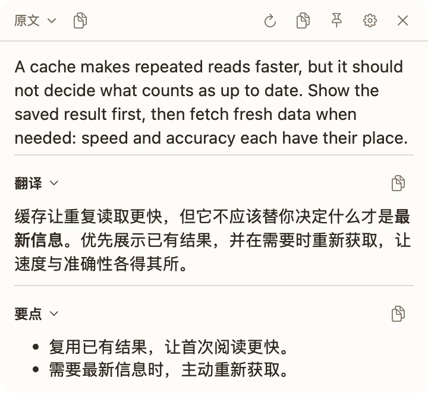
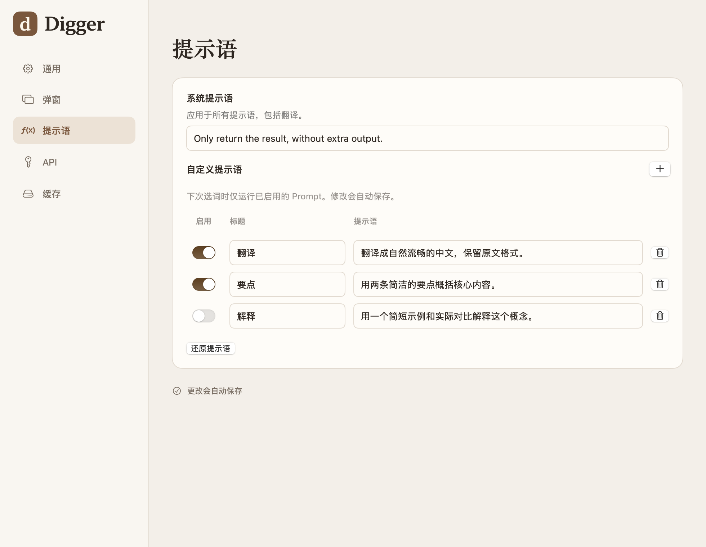
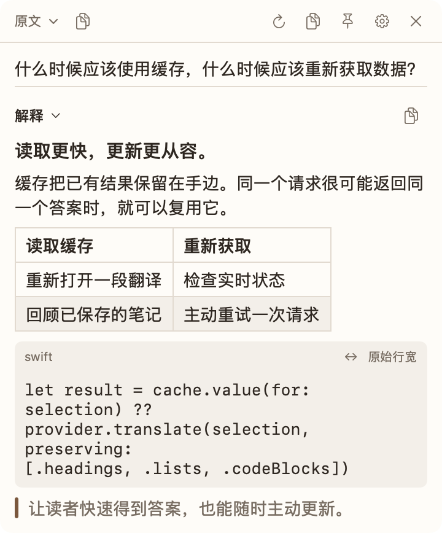
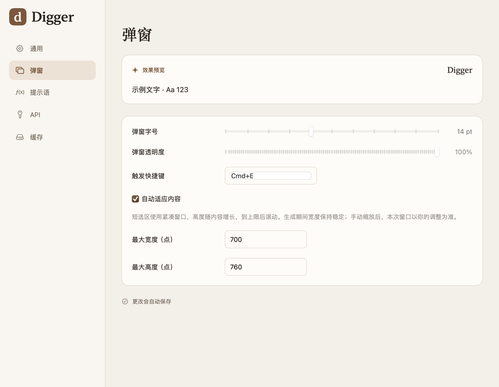
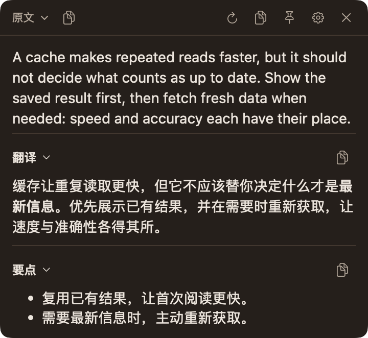
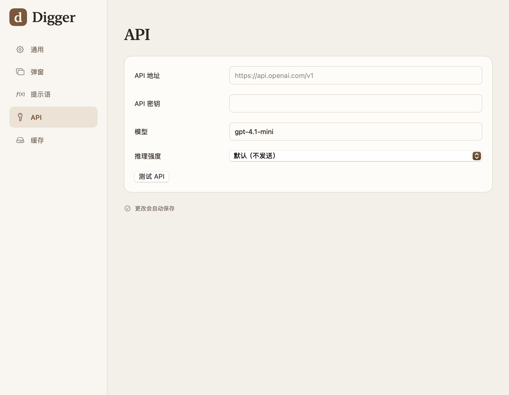

# Digger

**读懂字里行间。**

为你正在阅读的文字准备的原生 macOS 助手。选中一段内容，按下 **⌘E**，
在浮窗中查看翻译、摘要或解释。答案逐步呈现，阅读继续。

> 🌐 [English](README.md)
>
> [功能](#功能) · [开始使用](#开始使用) · [开发](#开发) · [文档](#文档)



*截图来自当前原生应用的隔离预览模式，使用示例文字和提示词，不包含真实 API 凭据或模型响应。*

## 功能

### 一次选中，多种答案

在浏览器、文档或其他向 macOS 提供文本选区的应用里，选中一段文字，按下 **⌘E**，
答案就会出现在手边。已启用的提示词并行运行，让翻译和简短摘要一起呈现。

展开原文，对照结果阅读；折叠暂时不需要的部分，或固定浮窗继续查看。
可以单独复制一条结果，也可以复制所有结果，或连同原文一起复制。

### 让提示词适合你的工作

翻译段落、提炼要点、解释陌生术语。在 **设置 → 提示词** 中选择每次划词要运行的操作，
写下适合自己工作习惯的提示词。

- **只运行需要的操作。** 每个操作都有独立的启用开关。
- **统一回答风格。** 共享的系统提示词作用于所有操作。
- **舒适地编辑。** 在原生多行编辑窗口中修改提示词。

默认启用 Translation，Summary 可自行开启。截图展示的是自定义配置，启用了「翻译」和「要点」。



### 读懂内容，也保留结构

答案以 Markdown 呈现，支持标题、嵌套列表、引用、链接、表格和代码。
浏览器选区可以通过本地 HTML 转 Markdown 保留结构，让上下文跟着文字一起留下。

代码默认随窗口宽度换行；需要保留排版时，可以切换到 **原始行宽**。
宽表格支持横向滚动。结果文字可以选中，也可以复制原始 Markdown 到笔记中。



### 适合阅读的浮窗

短选区使用紧凑窗口。答案流式生成时，浮窗高度随内容增长，到达设定上限后再滚动，
阅读宽度保持稳定。手动调整尺寸后，本次选区会沿用你的调整；也可以在设置中选择固定尺寸。

按习惯调整字号、透明度和全局快捷键。SwiftUI 与 AppKit 构建的原生界面跟随 Mac 的深浅色外观，
支持 English、简体中文和日本語。

<details>
<summary><strong>外观设置与深色模式</strong></summary>





</details>

### 连接自己的模型，随时重新获取

使用自己的地址、密钥和模型连接 **OpenAI 兼容 API**，选择服务支持的推理强度，
并直接在设置中测试连接。

完成的结果可以缓存在本机，容量和过期时间由你设置。点击重试可跳过缓存、重新生成。
停止生成时保留已经收到的文字；关闭浮窗会取消正在进行的任务。

<details>
<summary><strong>模型服务设置</strong></summary>



截图使用公开默认地址，密钥输入框为空。使用前请配置自己的模型服务。

</details>

## 开始使用

需要 **macOS 13 或更新版本**、**辅助功能权限**，以及一个 **OpenAI 兼容 API**。
Digger 作为原生菜单栏应用运行。

### 安装 macOS 应用

1. 打开主分支上一次成功的 [CI 运行](https://github.com/mrcroxx/digger/actions/workflows/ci.yml?query=branch%3Amain)。
2. 下载 **Digger-macOS**，解压并打开 DMG。确认文件名中的架构与你的 Mac 一致。
3. 将 **Digger.app** 拖入「应用程序」并打开。
4. 按提示授予 **辅助功能** 权限，在 **设置 → API** 中填写服务地址、API 密钥和模型，点击 **测试 API**。
5. 在其他应用中选中文字，按下 **⌘E**。

CI 安装包保留七天，使用临时签名，未经 Apple 公证。如果构建产物已过期，或需要其他架构，
可以按下方说明本地构建。签名和安装细节见 [开发指南](docs/development.md)。

### 随手调用

从菜单栏打开设置，把全局快捷键改成顺手的组合；如果希望登录后即可使用，可以开启登录时启动。

| 快捷键 | 操作 |
| --- | --- |
| **⌘E** | 对选中文字运行已启用的提示词，可在设置中修改 |
| **⌘⇧C** | 浮窗处于活动状态时，复制所有结果 |
| **⌘⌥C** | 浮窗处于活动状态时，复制原文和所有结果 |

### 你的数据与你的模型服务

调用 Digger 时，选中文字和提示词会直接发送给你配置的 API 服务。
本地缓存不意味着 AI 生成可以离线完成。设置和 API 密钥保存在这台 Mac 的偏好设置中；
目前密钥存储使用 **UserDefaults**，未使用 Keychain。

结果可能缓存在 `~/Library/Caches/digger/translation-cache`。
Digger 不会把选中文字或生成结果写入日志，Markdown 渲染器不会加载远程图片或执行 HTML。
当读取选区需要临时借助剪贴板复制时，Digger 会恢复此前的剪贴板内容。

## 开发

需要 macOS 和 **Swift 6.2+ 工具链**：

```bash
git clone https://github.com/mrcroxx/digger.git
cd digger
swift run digger
```

构建安装包：

```bash
DIGGER_MAC_UNSIGNED=1 ./scripts/package-desktop.sh
```

该命令会运行打包检查与测试，然后生成 `dist/Digger.app`，以及与构建机器架构一致的 DMG 和 ZIP。
打包不会自动安装应用。日常本地安装建议使用固定签名身份，详见 [开发指南](docs/development.md)。

使用离线示例查看界面，或重新生成截图：

```bash
swift run digger --preview --showcase
python3 scripts/capture-readme.py
```

## 文档

- [开发与打包](docs/development.md) — 构建、签名、验证与快捷键排查。
- [截图来源](docs/images/README.md) — 截图命令、示例内容与隐私说明。
- [原生界面](docs/native-redesign.md) — 设计风格与原生应用架构。

`docs/` 中其他会话记录描述了历史实现，部分行为可能已发生变化。
